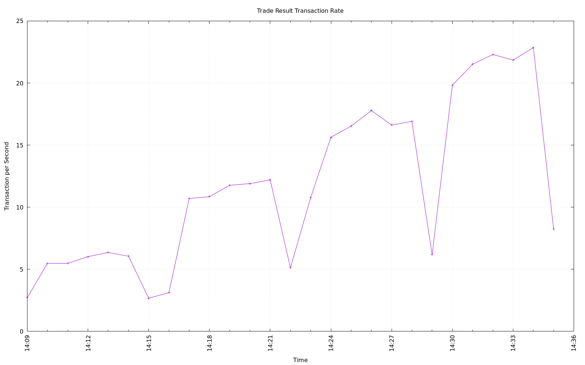
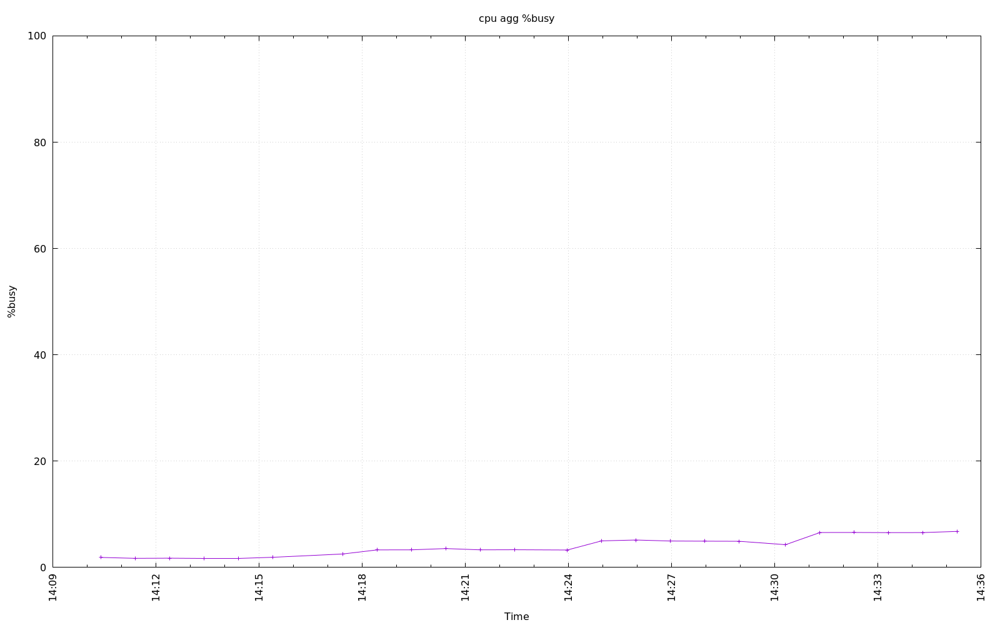

-------------------
Performance Testing
-------------------

There are many additional performance testing scenarios beyond using this
workload as defined by the TPC specification.  This sections describes some of
them.

Database Connection Scaling
===========================

This test is performed by the *test-user-scaling* script.

The purpose of this test is determine how many users, or database connections,
are needed to get as much throughput as possible out of the system.

This script is run a series of tests starting with 1 user up to the number of
detected processors of the driver system, adding 1 user per step in the series.
The script is primarily intended to be run in a 1-tier system configuration,
but may be run in a 2-tier configuration and may needs some additional
intelligence or options for that.

Each step in the series will spend 1 minute to warm up and establish all
connections to the database, then run for an additional 5 minutes and stop
before starting the next test in the series.  The warm up time and test
duration can be varied.

At the end of the test, the script will create a bar plot of the reported
metric of each test vs. the number of users.  The sar data from all the tests
will be aggregated and plotted.

Here are some examples plots from a system with 4 logical processors where it
spend 1 minute warming up before running another 5 minutes.

.. figure:: test-user-scaling/trpu.png
   :align: center
   :target: test-user-scaling/trpu.png
   :width: 100%

   Connection Scaling Transaction Rates per user

   Connection Scaling Transaction Rates

   Connection Scaling Processor Utilization

Database Parameter Effects
==========================

This test is performed by the *test-db-param* script.

The purpose of this test is to evaluate the effects of a changing a single
database parameter.

This script must be used with a configuration file and cannot currently be
controlled with just command line arguments.

The configure file must contain the following details in addition to any other
required configuration parameter (see configuration instructions in **User
Guide** section of the documentation):

1. database start command
2. database stop command
3. database parameter name
4. database parameter values to test

Here is an example for PostgreSQL that is testing 3 difference values for
`shared_buffers`::

    db_start_command = "pg_ctl -D /tmp/pgdata start"
    db_stop_command = "pg_ctl -D /tmp/pgdata stop -m fast"
    db_param_name = "shared_buffers"
    db_param_values = ["1GB", "2GB", "3GB"]

At the end of the test, the script will create a bar plot of the reported
metric of each test vs. the value of database parameter being evaluated.  The
sar data from all the tests will be aggregated and plotted, as shown in the
**Database Parameter Effects** section.

Here is an example plot of the above example.

.. figure:: test-db-param/trpp.png
   :align: center
   :target: test-db-param/trpp.png
   :width: 100%

   Evaluating PostgreSQL shared_buffers
